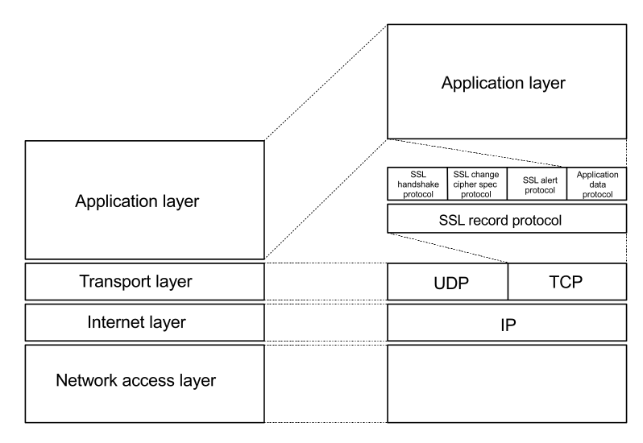

# SSL

SSL protocol is a client/server protocol that provides the following basic security services to the communicating peers:

- Authentication (both peer entity and data origin authentication) services;
- Connection confidentiality services;
- Connection integrity services (without recovery);
- SSL protocol is application-layer protocol-independent (any TCP-based application protocol can be layered on top of it to provide the basic security services);
- SSL protocol is block-oriented with a block size of one byte (eight bits);

## Overall

### Details

- the **TLS** and **DTLS** protocols are very similar (and in many regards even identical) to the **SSL** protocol;
- the **SSL** protocol is really key to properly understanding the TLS and DTLS protocols;
- SSL protocol uses **public key** cryptography does not provide **nonrepudiation** services;
- SSL protocol is sockets-oriented (all or none of the data that is sent to or received from a network connection is cryptographically protected in exactly the same way);
- SSL can be best viewed as an **intermediate layer** between the **transport** and the **application** layer;

### Purposes

- establish a secure (i.e., authentic and confidential) connection between the communicating peers;
- fragment the data into manageable pieces (called fragments) and processes each fragment individually;
- each fragment is optionally compressed (depending on the mode of operation, encryption may include padding), authenticated, encrypted;
- each fragment is sent in a **distinct SSL record** (our fields: a type field, a version field, a length field, and a fragment field);
- on the recipient’s side, the SSL records are decrypted,5 authenticated, decompressed, and reassembled;

### Place in protocol hierarchy

- the lower sublayer is stacked on top of some connection-oriented and reliable transport layer protocol, such as TCP;
- the higher sublayer is stacked on top of the SSL record protocol and comprises four **subprotocols**:
  1. _SSL handshake protocol_ - used for establishment of a secure connection (negotiate a cipher suite and a compression method);
  2. _SSL change cipher spec protocol_ - allows the communicating peers to signal to each other a cipher spec change;
  3. _SSL alert protocol_ - allows the communicating to signal indicators of potential problems (alert messages);
  4. _SSL application data protocol_ - secure transmission of application data;

## Messaging overview

- multiple SSL messages may be carried inside a single SSL record;
- SSL protocol is self-delimiting - it can autonomously (without the assistance of TCP) determine the beginning and ending of an SSL record that is transported;
- compressing data in SSL/TLS is dangerous and should be avoided in the first place;

### Secure and nonsecure versions

Servers should be prepared to accept both secure and nonsecure versions of any given application-layer protocol.

1. Separate port strategy - two different port numbers are assigned to the secure and nonsecure versions of the application-layer protocol;
2. Upward negotiation strategy - a single port is used for both versions of the application-layer protocol;

## SSL session 

- SSL session - association between two communicating peers that is established by the SSL handshake protocol. 
- SSL session defines a set of cryptographic  parameters that are commonly used by the SSL connections associated with the session to cryptographically protect and optionally compress data.
- SSL session can be shared among multiple SSL connections,
- SSL sessions are primarily used to avoid the necessity to perform a computationally expensive negotiation of new cryptographic parameters for each connection individually.

## SSL/TLS secure protocols/ports (short list)

| Protocol  | Description                    | Port  |
|-----------|--------------------------------|-------|
| nsiiops   | IIOP Name Service over SSL/TLS | 261   |
| https     | HTTP over SSL/TLS              | 443   |
| nntps     | NNTP over SSL/TLS              | 563   |
| ldaps     | LDAP over SSL/TLS              | 636   |
| ftps-data | FTP Data over SSL/TLS          | 989   |
| ftps      | FTP Control over SSL/TLS       | 990   |
| telnets   | Telnet over SSL/TLS            | 992   |
| imaps     | IMAP4 over SSL/TLS             | 993   |
| ircs      | IRC over SSL/TLS               | 994   |
| pop3s     | POP3 over SSL/TLS              | 995   |
| tftps     | TFTP over SSL/TLS              | 3713  |
| sip-tls   | SIP over SSL/TLS               | 061   |

## SSL connection state elements

### server and client random

Byte sequences that are chosen by the server and client for each connection.

### Server write MAC key

Secret used in MAC operations on data written by the server.

### Client write MAC key

Secret used in MAC operations on data written by the client.

### Server write key

Key used for data encrypted by the server and decrypted by the client.

### Client write key

Key used for data encrypted by the client and decrypted by the server.

### Initialization vectors

If a block cipher in CBC mode is used for data encryption, then an IV must be maintained for each key. This field is first initialized by the SSL handshake protocol. 
Afterward, the final ciphertext block from each SSL record is preserved to serve as IV for the next record.

### Sequence numbers

SSL message authentication employs sequence numbers - the client and server must maintain a sequence number for the messages that are transmitted or received on a particular 
connection. Each sequence number is 64 bits long and ranges from 0 to 2**64 − 1. It is set to zero whenever a ChangeCipherSpec message is sent or received. Since it cannot 
wrap, a new connection must be negotiated when the number reaches 2**64 − 1.
