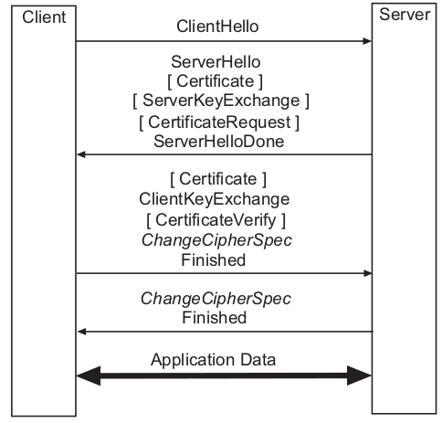

# SSL Handshake Protocol

- the SSL handshake protocol is layered on top of the SSL record protocol;
- protocol allows a client and server to **authenticate** each other and to **negotiate** issues like **cipher suites** and **compression methods**;
- the SSL handshake protocol comprises four sets of messages (_flights_);
- fifth set is **HelloRequest message** (type value 0x00 or 0), that may be sent from the server to the client to initiate an SSL handshake (rarely used);

Message flow:

- The first flight comprises a single ClientHello message (type value 0x01 or 1) that is sent from the client to the server;
- The second flight comprises two to five messages that are sent back from the server to the client:
    1. A **ServerHello** message (type value 0x02 or 2) is sent in response to the **ClientHello** message;
    2. If the server is to authenticate itself (which is generally the case), it may send a **Certificate** message (type value 0x0B or 11) to the client;
    3. Under some circumstances (discussed below), the server may send a **ServerKeyExchange** message (type value 0x0C or 12) to the client;
    4. If the server requires the client to authenticate itself with a public key certificate, then it may send a **CertificateRequest** message (type value 0x0D or 13)
       to the client;
    5. Finally, the server sends a **ServerHelloDone** message (type value 0x0E or 14) to the client;
- After having exchanged ClientHello and ServerHello messages, the client and server have negotiated a protocol version, a session identifier (ID), a cipher suite, 
  and a compression method;
- Two random values (ClientHello.random and ServerHello.random) have been generated and are now available for further use;
- The third flight comprises three to five messages that are again sent from the client to the server:
    1. If the server has sent a **CertificateRequest** message, then the client sends a **Certificate** message (type value 0x0B or 11) to the server;
    2. In the main step of the protocol, the client sends a **ClientKeyExchange** message (type value 0x10 or 16) to the server. The contents of this message depend 
       on the key exchange algorithm in use;
    3. If the client has sent a certificate to the server, then it must also send a **CertificateVerify** message (type value 0x0F or 15) to the server.
       This message is digitally signed with the private key that corresponds to the client certificate’s public key;
    4. The client sends a **ChangeCipherSpec** message to the server (using the SSL change cipher spec protocol) and copies its pending write state into the current 
       write state;
    5. The client sends a **Finished** message (type value 0x14 or 20) to the server (first message that is cryptographically protected under the new cipher spec);
- The fourth flight comprises two messages that are sent from the server back to the client:
    1. The server sends another **ChangeCipherSpec** message to the client and copies its pending write state into the current write state;
    2. The server sends a Finished message (type value 0x14 or 20) to the client (cryptographically protected under the new cipher spec);

### Session renegotiation/resumption

#### Renegotiation

- the SSL protocol allows a client to request a session renegotiation at any point in time simply by sending a new **ClientHello** message to the server;
- if the server wishes to renegotiate, then it can send a **HelloRequest** message (type value 0x00 or 0) to the client;
- renegotiating a new session is not particularly efficient, because a full handshake must be performed;

#### Resumption

- if a handshake has already been performed recently, then the respective session may be resumed in 1 round-trip time (1-RTT);
- session resumption is much more efficient than session renegotiation;
- The client sends a **ClientHello** message including the session **ID** of the session that it wants to resume;
- the server checks its session cache for a match for this particular **ID**;
- if a match is found and the server is willing to reestablish a connection under this session state, then it sends back to the client a **ServerHello** message with this 
  particular session **ID**;
- the client and server can then directly move to the **ChangeCipherSpec** and **Finished** messages;
- if a session ID match is not found, then the server must generate a new session ID and the client and server must go through a full SSL handshake;