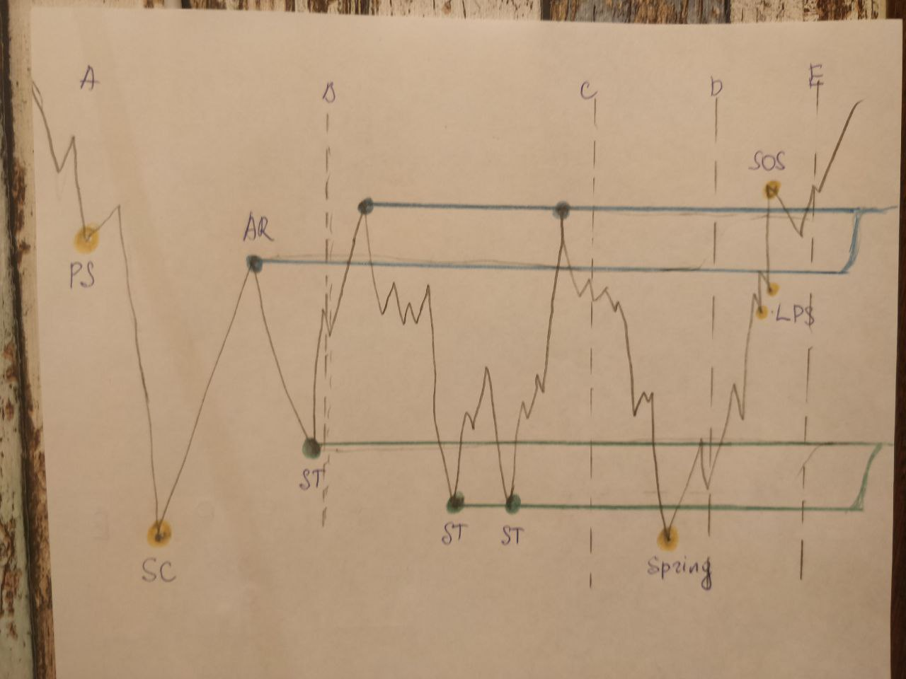
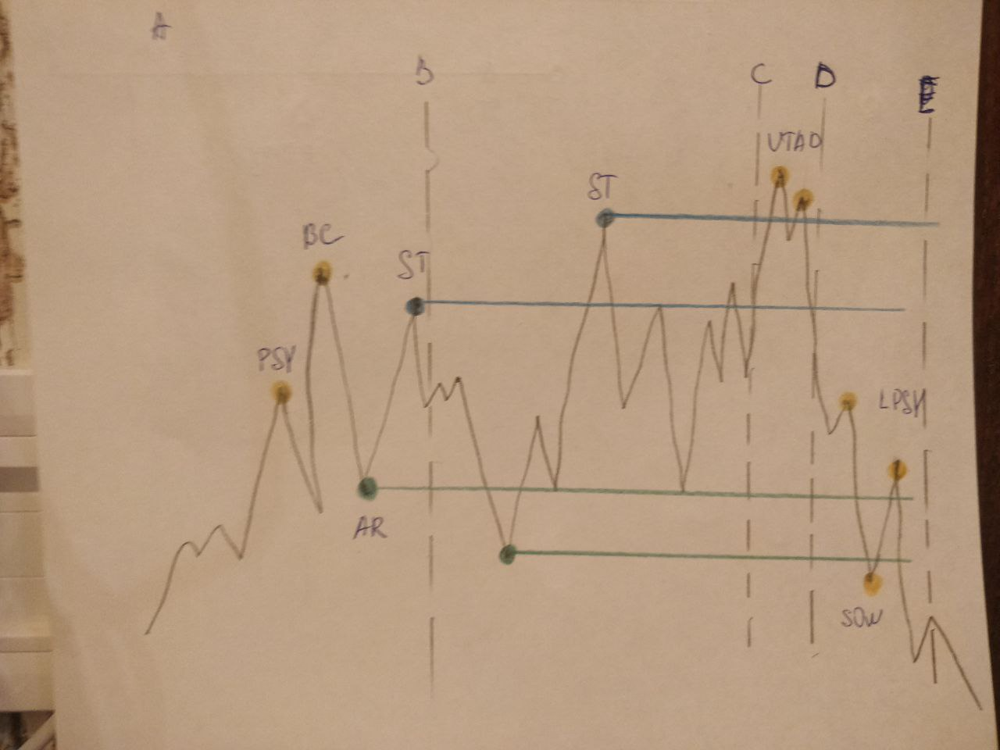

# Wyckoff Method

Is an extensive trading and investing strategy that was developed by Charles Wyckoff in the 1930s. His work in this area is particularly valuable to cryptocurrency traders.

## Laws

- _the law of supply and demand_;
- _the Law of Cause and Effect_;
- _the Law of Effort vs. Result_;

### The Law of Supply and Demand

That prices rise when demand is greater than supply, and drop when the opposite is true:

- Demand > Supply = Price rises;
- Demand < Supply = Price drops;
- Demand = Supply = No significant price change (low **volatility**);

### The Law of Cause and Effect

- the differences between supply and demand are not random;
- a period of accumulation (cause) eventually leads to an uptrend (effect);
- a period of distribution (cause) eventually results in a downtrend (effect);

### The Law of Effort vs. Result

- if the price action is in harmony with the volume, there is a good chance the trend will continue;
- if the volume and price diverge significantly, the market trend is likely to stop or change direction;

**Example:**

- the **Bitcoin** market starts to consolidate with a very high volume after a long **bearish** trend;
- the high volume indicates a big effort, but the sideways movement (**low volatility**) suggests a small result;
- there is a lot of Bitcoins changing hands, but no more significant price drops;
- such a situation could indicate that the downtrend may be over, and a reversal is near;

## Steps

- **Determine the trend**: what’s it like now, and where is it headed?
- **Identify strong assets**: are they moving with the market or in the opposite direction?
- **Find assets with sufficient Cause**: is there enough reason to enter the position? Do the risks make the potential reward worth it?
- **Assess the likelihood of the movement**: do things like Wyckoff’s Buying and Selling Tests point to a possible movement? What do the price and volume suggest? Is this asset ready to move?
- **Time your entry**: how are the assets looking in relation to the general market? When is the best time to enter a position?

## Techniques

- three fundamental laws;
- the Composite Man concept;
- a methodology for analyzing charts (Wyckoff’s Schematics);
- a five-step approach to the market;

## The three laws of Wyckoff

### The Law of Supply and Demand

- _Demand > Supply = Price rises_;
- _Demand < Supply = Price drops_;
- _Demand = Supply = No significant price change (low volatility)_;

### The Law of Cause and Effect

- the differences between supply and demand are not random, they come after periods of preparation, as a result of specific events;
- a period of accumulation (cause) eventually leads to an uptrend (effect);
- a period of distribution (cause) eventually results in a downtrend (effect);

### The Law of Effort vs. Result

- the changes in an asset’s price are a result of an effort, which is represented by the trading volume;
- if the price action is in harmony with the volume, there is a good chance the trend will continue;
- if the volume and price diverge significantly, the market trend is likely to stop or change direction;

Example:

- the Bitcoin market starts to consolidate(укреплять) with a very high volume after a long bearish trend;
- the high volume indicates a big effort, but the sideways movement (low volatility) suggests a small result;
- there is a lot of Bitcoins changing hands, but no more significant price drops;
- such a situation could indicate that the downtrend may be over, and a reversal is near;

### The Composite Man (Composite Operator)

- investors and traders should study the stock market as if a single entity was controlling it;
- the Composite Man represents the biggest players (market makers), such as wealthy individuals and institutional investors;
- the Composite Man’s behavior is the opposite of the majority of retail investors, which **Wyckoff** often observed losing money;
- the Composite Man uses a somewhat predictable strategy, from which investors can learn from;

#### Accumulation

- the Composite Man accumulates assets before most investors; 
- this phase is usually marked by a sideways(направленный в сторону) movement; 
- the accumulation is done gradually to avoid the price from changing significantly;

#### Uptrend

- when the Composite Man is holding enough shares, and the selling force is depleted, he starts pushing the market up;
- the emerging trend attracts more investors, causing demand to increase;
- there may be multiple phases of accumulation during an uptrend;
- demand is excessively higher than supply;

#### Distribution

- the Composite Man starts distributing his holdings;
- he sells his profitable positions to those entering the market at a late stage;
- the distribution phase is marked by a sideways movement that absorbs demand until it gets exhausted;

#### Downtrend

- the Composite Man is done selling a good amount of his shares, he starts pushing the market down;
- Eventually, the supply becomes much greater than demand, and the downtrend is established;
- the downtrend may also have re-distribution phases;

## Wyckoff’s Schematics

- these models break down the Accumulation and Distribution phases into smaller sections;
- the sections are divided into five Phases (A to E), along with multiple Wyckoff Events;

### Accumulation

#### Phase A

- the selling force decreases, and the downtrend starts to slow down;
- this phase is usually marked by an **increase** in trading volume;
- **the Preliminary Support (PS)** indicates that some buyers are showing up, but still not enough to stop the downward move;
- **the Selling Climax (SC)** is formed by an intense selling activity as investors **capitulate**;
- this is often a point of high volatility, where panic selling creates big candlesticks and wicks;
- the strong drop quickly reverts into a bounce or **Automatic Rally (AR)**, as the excessive supply is absorbed by the buyers;
- in general, the **trading range (TR)** of an Accumulation Schematic is defined by the space between the **SC** low and the **AR** high;
- the **Secondary Test (ST)** happens when the market drops near the **SC regio**n, testing whether the downtrend is really over or not;
- at this point, the trading volume and market volatility tend to be lower;
- while the **ST** often forms a higher low in relation to the **SC**, that may not always be the case;

#### Phase B

- **Phase B** may be seen as the Cause that leads to an Effect;
- **Phase B** is the consolidation stage, in which the Composite Man accumulates the highest number of assets;
- during this stage, the market tends to test both **resistance** and **support** levels of the trading range;
- there may be numerous **Secondary Tests (ST)** during **Phase B**;
- they may produce higher highs (bull traps) and lower lows (bear traps) in relation to the **SC** and **AR** of the **Phase A**;

#### Phase C

- a typical Accumulation Phase C contains what is called a **Spring**;
- it often acts as the last bear trap before the market starts making higher lows;
- during Phase C, the **Composite Man** ensures that there is little supply left in the market (the ones that were to sell already did);
- the **Spring** often breaks the support levels to stop out traders and mislead investors;
- the **bear trap** induces retail investors to give up their holdings;
- in some cases the support levels manage to hold, and the **Spring** simply does not occur;

#### Phase D

- **Phase D** represents the transition between the Cause and Effect;
- **Phase D** shows a significant increase in trading volume and volatility;
- it usually has a **Last Point Support (LPS)**, making a higher low before the market moves higher;
- the LPS often precedes a breakout of the **resistance** levels, which in turn creates **higher highs**;
- this indicates **Signs of Strength (SOS)**, as previous **resistances** become brand new **supports**;
- there may be more than one LPS during **Phase D** - they often have increased trading volume while testing the new support lines;
- in some cases, the price may create a small consolidation zone;

#### Phase E

- **Phase E** is the last stage of an Accumulation Schematic;
- it is marked by an evident breakout of the trading range, caused by increased market demand;
- this is when the trading range is effectively broken, and the uptrend starts;

### Distribution

#### Phase A

- occurs when an established uptrend starts to slow down due to decreasing demand;
- **the Preliminary Supply (PSY)** suggests that the selling force is showing up, although still not strong enough to stop the upward movement;
- the **Buying Climax (BC)** is then formed by an intense buying activity (usually caused by inexperienced traders that buy out of emotions);
- the strong move up causes an **Automatic Reaction (AR)**, as the excessive demand is absorbed by the market makers (Composite Man starts distributing his holdings to the late buyers);
- the **Secondary Test (ST)** occurs when the market revisits the **BC region**, often forming a lower high;

#### Phase B

- Phase B of a Distribution acts as the consolidation zone (Cause) that precedes a downtrend (Effect);
- During this phase, the Composite Man gradually sells his assets, absorbing and weakening market demand;
- the upper and lower bands of the trading range are tested multiple times, which may include short-term **bear and bull traps**;
- sometimes, the market will move above the **resistance** level created by the **BC**, resulting in an **ST** that can also be called an **Upthrust (UT)**;

#### Phase C

- in some cases, the market will present one last bull trap after the consolidation period (UTAD or Upthrust After Distribution) - the opposite of an **Accumulation Spring**; 

#### Phase D

- is a mirror image of the **Accumulation one**;
- it usually has a **Last Point of Supply (LPSY)** in the middle of the range, creating a lower high;
- from this point, new **LPSYs** are created (either around or below the support zone);
- an evident **Sign of Weakness (SOW)** appears when the market breaks below the **support** lines;

#### Phase E

- the last stage of a Distribution marks the beginning of a **downtrend**;

#### Five-step approach

1. Determine the trend (What is the current trend and where it is likely to go? How is the relation between supply and demand?);
2. Determine the asset’s strength (How strong is the asset in relation to the market? Are they moving in a similar or opposite fashion?);
3. Look for assets with sufficient Cause (Are there enough reasons to enter a position? Is the Cause strong enough that makes the potential rewards (Effect) worth the risks?)
4. Determine how likely is the move (is the asset ready to move? What is its position within the bigger trend? What do the price and volume suggest?)- Wyckoff’s Buying and Selling Tests;
5. Time your entry (it usually involves analyzing a stock in comparison to the general market);