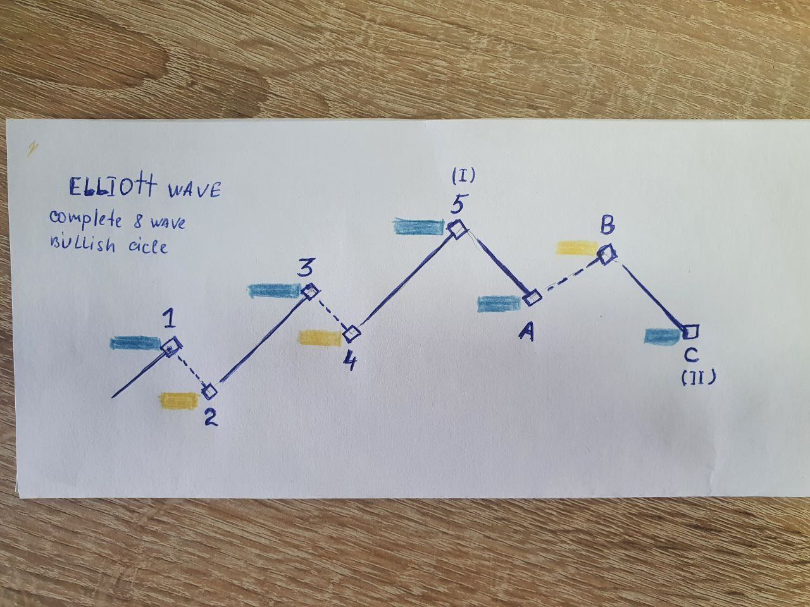
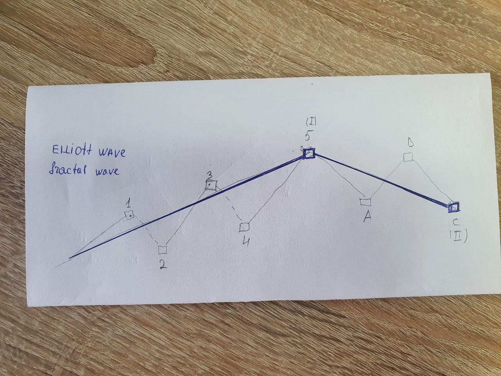
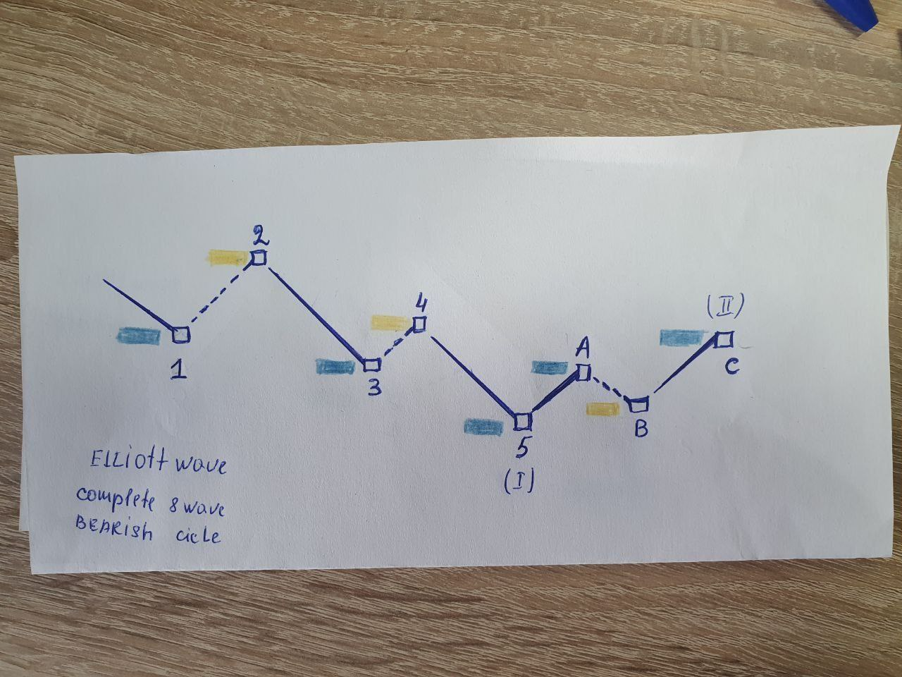
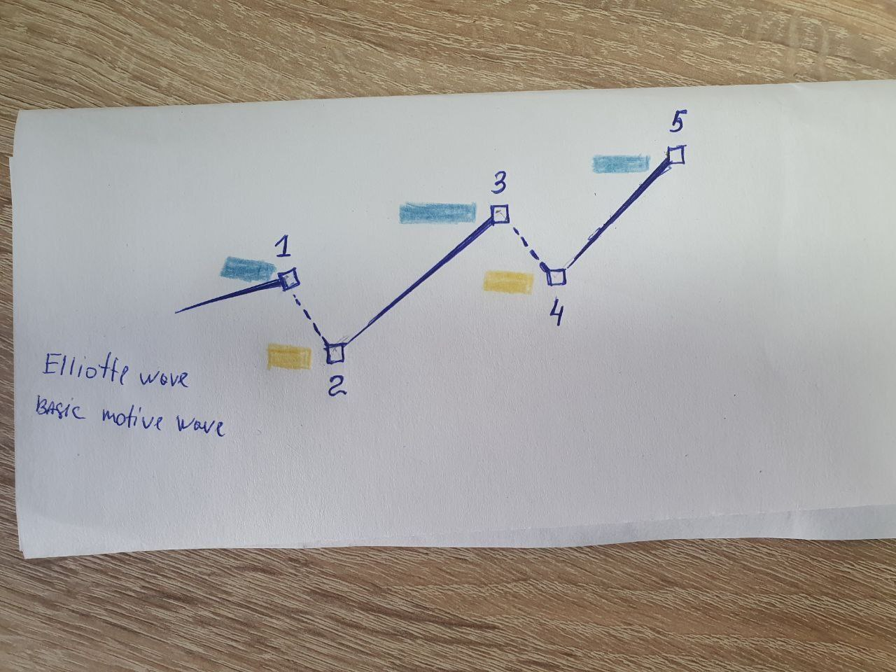
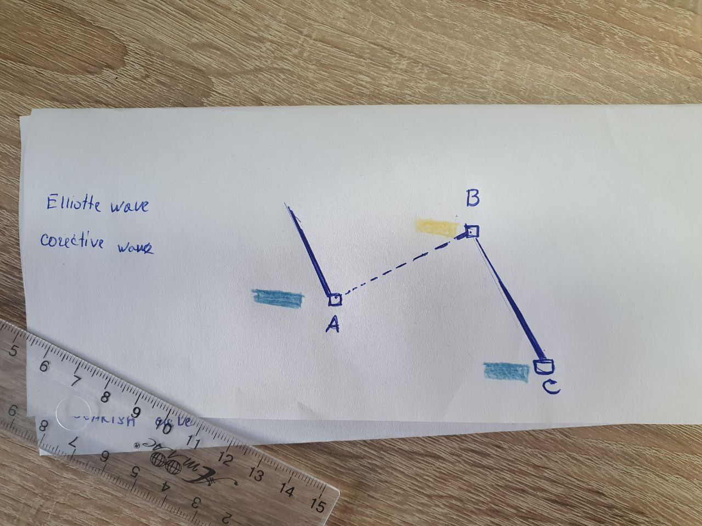

# Elliott Wave Theory

The Elliott Wave refers to a theory (or principle) that investors and traders may adopt in technical analysis.

- is a principle positing that market movements follow the psychology of market participants;
- **it isn’t an indicator or specific trading technique**;
- can be identified in a series of **eight** waves, each of which is either a **Motive Wave** or a **Corrective Wave**;
- the patterns also have a fractal property, meaning that the user could zoom into a single wave to see another Elliot Wave pattern;
- alternatively, user could zoom out to find that the pattern he has been examining is also a single wave of a bigger Elliot Wave cycle;
- **many traders have had great success by combining EWT with other technical analysis tools**;
- the **Fibonacci Retracement** and the **Fibonacci Extension** indicators are perhaps the most popular examples;
- **its use can be risky - especially for beginners**;

## The basic Elliott Wave pattern

Typically, the basic Elliott Wave pattern is identifiable by an eight-wave pattern, which contains five **Motive Waves** (that move in favor of the major trend), and three 
**Corrective Waves** (that move in the opposite direction).

- five **Motive Waves** (three in the upward move (1, 3, and 5), plus two in the downward move (A and C));
- any move that is in accordance with the major trend may be considered a Motive Wave;
- 2, 4, and B are the three Corrective Waves;

According to Elliott, financial markets create patterns of a **fractal nature**. If we zoom out to longer timeframes, the movement from 1 to 5 can also be considered a 
single **Motive Wave** (I), while the A-B-C move may represent a single Corrective Wave (II).

If we zoom in to lower timeframes, a single Motive Wave (such as 3) can be further divided into five smaller waves.

An Elliott Wave cycle in a bearish market would look like this:

### Motive Waves

- **Motive Waves** always move in the same direction as the bigger trend;
- Elliott described two types of wave development: **Motive** and **Corrective Waves**;
- The previous example involved **five Motive** and **three Corrective Waves**;
- If we zoom in to a **single Motive Wave**, it will consist of a smaller **five-wave structure**;

Elliott called it the Five-Wave Pattern, and he created three rules to describe its formation:

1. Wave 2 can't retrace(возвращаться) more than 100% of the preceding wave 1 move;
2. Wave 4 can't retrace(возвращаться) more than 100% of the preceding wave 3 move;
3. Among waves 1, 3, and 5, wave 3 can't be the shortest and is often the longest one. 
4. Wave 3 always moves past the end of Wave 1;

### Corrective Waves

- **Corrective Waves** are typically made of a three-wave structure;
- they are often formed by a smaller Corrective Wave occurring between two larger Motive Waves;
- the three waves are often named A, B, and C;

When compared to Motive Waves, Corrective Waves tend to be smaller because they move against the bigger trend.

- **Corrective Waves** is that they are never made of five waves;
- **Corrective Waves** much harder to identify as they can vary significantly in length and complexity;